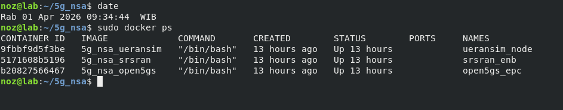
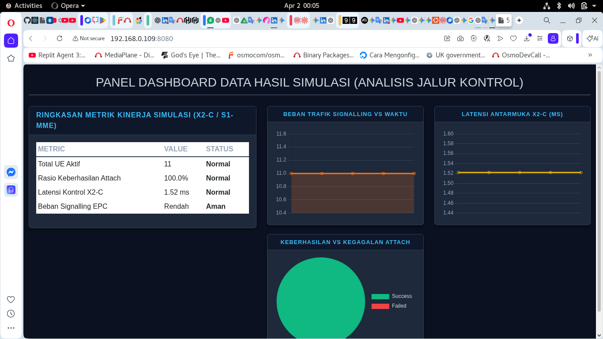
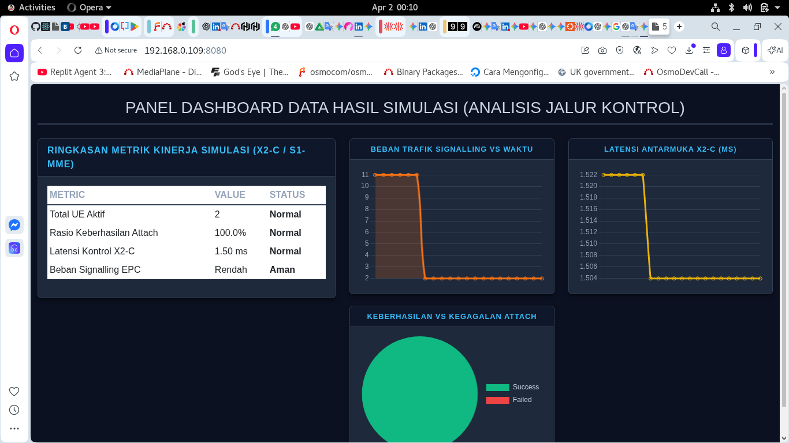

# Security Policy: 5G NSA & Network Security Function (NSF) Research

## Overview
This security policy governs the vulnerability reporting process for research conducted by **PT NOZ Berkarya Indonesia**. Our research environment is strictly isolated, utilizing **Open5GS (NSA)**, **srsRAN**, and **UERANSIM** as the primary stack to replicate complex signaling scenarios and user-plane stress tests.

## Supported Versions

We actively provide security research and validation for the following simulation environments:

| Version (Simulation Stack) | Supported          | Core Technology                          |
| -------------------------- | ------------------ | ---------------------------------------- |
| 5G NSA (Option 3x) v1.x    | :white_check_mark: | Open5GS + srsRAN + UERANSIM              |
| X2-C Interface Research    | :white_check_mark: | Signalling Storm Analysis                |
| User Storm Simulation      | :white_check_mark: | UERANSIM Mass Registration & Load        |
| NSF Testing Framework      | :white_check_mark: | Isolated Lab Environment                 |
| Legacy EPC (Standalone)    | :x:                | Non-Supported                            |

## Reporting a Vulnerability

If you identify a potential security flaw—particularly regarding **X2-C interface signaling**, **SIP Registration anomalies**, or **Signalling/User Storm mitigation**—please report it through the following process.

### How to Report
1. **Private Disclosure**: Do not open a public GitHub issue. Please send a detailed technical report to:
   - **Primary**: tri@noz.co.id
   - **Technical Lead**: f4co@noz.co.id
2. **Required Documentation**:
   - **Scenario Description**: Specifically detailing the replication of **Signaling and User Storm scenarios** (e.g., mass UE attachment via UERANSIM) and their impact on **Network Security Function (NSF)** capabilities.
   - **Technical Proof (PoC)**: PCAP files (Wireshark), Docker logs, or configuration files for srsRAN, Open5GS, and UERANSIM used in the isolated setup.
   - **Metrics**: Data showing how the X2-C link and Core AMF/MME react under stress from UERANSIM-generated traffic.

### Vulnerability Classification (Based on Simulation Metrics)
- **CRITICAL**: Core Network authentication bypass or unauthorized access to the HSS/UDM within the 5G NSA stack.
- **HIGH**: Validated vulnerabilities that bypass **Network Security Function (NSF)** controls during heavy User Storms or signaling bursts.
- **MEDIUM**: Routing anomalies, SIP-level packet drops, or UERANSIM connectivity failures observed in isolated EPC/IMS environments.

## Our Commitment
Upon receiving a report, our team will validate the finding within our isolated UERANSIM + srsRAN + Open5GS testbed and assist in reporting to the respective FOSS maintainers for CVE registration.

---
*Note: All research is conducted in compliance with 3GPP standards (TS 23.501, TS 33.501) for the purpose of global telecommunication security improvement.*

**Author:** Tri Sumarno, S.H., M.T.I.  
**Affiliation:** PT NOZ Berkarya Indonesia

